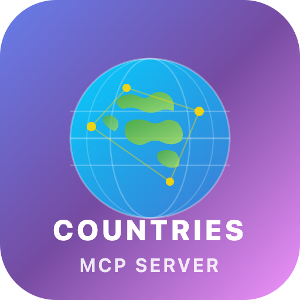

<p align="center">
  
</p>

<h1 align="center">🌍 Countries MCP Server</h1>

<p align="center">
  <strong>A Model Context Protocol (MCP) server that gives AI assistants access to comprehensive country data from 250+ countries.</strong>
</p>

<p align="center">
  <a href="https://github.com/bhayanak/countries-mcp-server/actions"></a>
  <a href="LICENSE"></a>
  <a href="https://www.npmjs.com/package/countries-mcp-server"></a>
  <a href="https://marketplace.visualstudio.com/items?itemName=bhayanak.countries-mcp-vscode"></a>
</p>

---

Wraps the [REST Countries API v3.1](https://restcountries.com/) — a free, open-source API serving data on 250+ countries. **No API key required.** The MCP server exposes **13 tools** for searching, filtering, comparing, and exploring country data — optimized for AI consumption.

## ✨ Features

| Category | Tools | What AI Can Do |
|----------|-------|----------------|
| 🔍 **Lookup** | 3 tools | Get country by name, code, or exact full name |
| 🔎 **Search** | 3 tools | Find by currency, language, or capital city |
| 🌐 **Filter** | 3 tools | Filter by region, subregion, or demonym |
| 📦 **Bulk** | 2 tools | Get all countries or multiple by codes |
| ⚖️ **Compare** | 1 tool | Side-by-side country comparison |
| 🗺️ **Neighbors** | 1 tool | Discover bordering countries |

## 📦 Packages

| Package | Description | Docs |
|---------|-------------|------|
| [`countries-mcp-server`](packages/countries-mcp-server/) | MCP server (npm package) | [Server README →](packages/countries-mcp-server/README.md) |
| [`countries-mcp-vscode`](packages/countries-vscode-extension/) | VS Code extension | [Extension README →](packages/countries-vscode-extension/README.md) |

## 🚀 Quick Start

### VS Code Extension (recommended)

Install from the [VS Code Marketplace](https://marketplace.visualstudio.com/items?itemName=bhayanak.countries-mcp-vscode) or search **"Countries MCP"** in Extensions. The MCP server appears automatically in VS Code's MCP servers list with start/stop/restart controls.

### npm (standalone)

```bash
npm install -g countries-mcp-server
```

Then add to your AI client's MCP configuration. See the [Server README](packages/countries-mcp-server/README.md) for details.

## 🏗️ Development

```bash
# Clone & install
git clone https://github.com/bhayanak/countries-mcp-server.git
cd countries-mcp-server
pnpm install

# Build everything
pnpm run build

# Run all tests
pnpm test

# Full CI validation
pnpm run ci
```

### Available Scripts

| Script | Description |
|--------|-------------|
| `pnpm run build` | Build all packages |
| `pnpm run dev` | Run server in dev mode |
| `pnpm test` | Run all tests |
| `pnpm run test:coverage` | Tests + coverage report |
| `pnpm run lint` | ESLint check |
| `pnpm run typecheck` | TypeScript type check |
| `pnpm run format` | Prettier format check |
| `pnpm run ci` | Full CI pipeline |
| `pnpm run package` | Package server (.tgz) + extension (.vsix) |

## 🛠️ Tech Stack

TypeScript · Node.js ≥ 18 · `@modelcontextprotocol/sdk` · Zod · tsup · esbuild · Vitest · ESLint · Prettier · pnpm workspaces

## 📄 License

[MIT](LICENSE) © bhayanak
